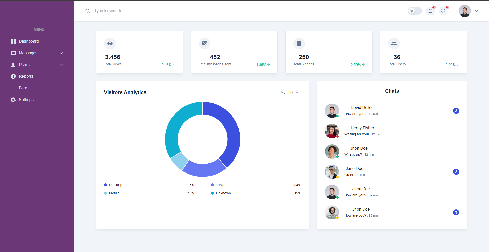

Project Documentation: React TypeScript Vite with Storybook

Project Overview

This project is a frontend application built using React with TypeScript and Vite as the build tool. Storybook is used for component-driven development and documentation. This project aims to create reusable, modular, and well-documented UI components for the web.

1. Project Setup
This project utilizes React, TypeScript, Vite, and Storybook for building and documenting UI components. Follow the setup instructions to get the application running locally.

Prerequisites
Node.js (version 16.x or higher)
npm or yarn (package manager)
Initial Setup
Clone the repository:

bash
Copy code
git clone https://github.com/yourusername/frontend-project.git
cd frontend-project
Install dependencies using npm or yarn:

bash
Copy code
npm install
# or
yarn install
2. Development Environment
Technologies Used:

React (UI framework)
TypeScript (Type safety for the React app)
Vite (Fast bundler and build tool)
Storybook (UI component development and documentation)
Tools:

Visual Studio Code (VS Code) for development
npm or yarn for package management
ESLint for linting and code style enforcement
Prettier for code formatting

4. Key Features
React & TypeScript: Build scalable and type-safe React components.
Vite: Lightning-fast development build tool for better performance.
Storybook: Create and document UI components in isolation.
ESLint & Prettier: Maintain code quality and consistency across the project.
5. Installation and Running the Application
Running the Development Server
Start the Vite development server:

bash
Copy code
npm run dev
# or
yarn dev
Open the browser and navigate to http://localhost:5173 to view the app.

Running Storybook
Start Storybook for component development and documentation:

bash
Copy code
npm run storybook
# or
yarn storybook
Open the browser and navigate to http://localhost:6006 to view Storybook.

6. Storybook Integration
Storybook is integrated into the project for documenting and testing UI components in isolation. It allows developers and designers to view components in different states and configurations.

Storybook Configuration
Storybook configuration files are stored in the .storybook directory. Key files include:

main.js: Configures which stories to load and add-ons.
preview.js: Adds global decorators and parameters.
manager.js: Customizes the Storybook UI (optional).

Scripts and Commands
Command	Description
npm run dev	Start the development server using Vite.
npm run storybook	Start Storybook for component development and docs.
npm run build	Build the project for production.
npm run test	Run Jest tests for the project.

# safetyUI
